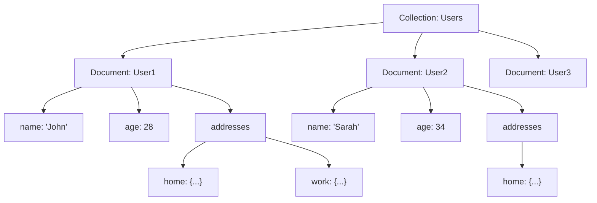
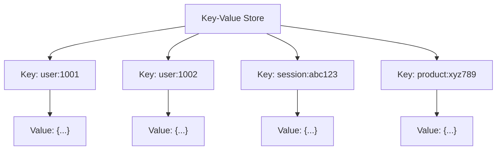
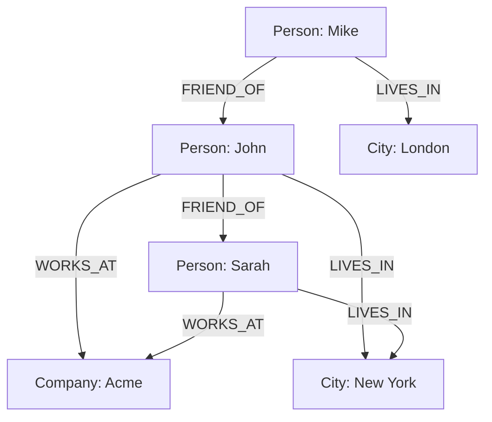
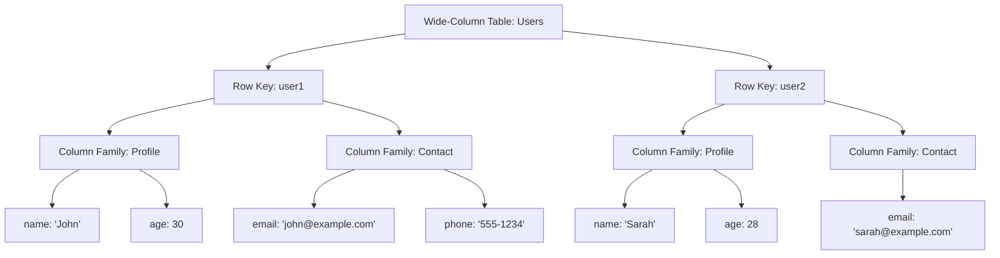
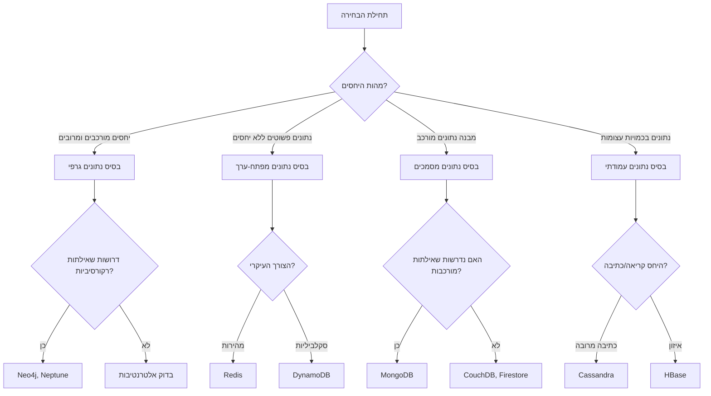

<div dir="rtl">

# סוגי בסיסי נתונים NoSQL: מדריך מקיף

## מבוא

בסיסי נתונים NoSQL (Not Only SQL) התפתחו כמענה לאתגרים שבסיסי נתונים רלציוניים מסורתיים התקשו להתמודד איתם - במיוחד בעידן הנתונים הגדולים (Big Data), האינטרנט ויישומים בקנה מידה גלובלי. בניגוד לבסיסי נתונים רלציוניים המשתמשים בטבלאות וסכמות קשיחות, בסיסי נתונים NoSQL מציעים גמישות, סקלביליות וביצועים משופרים במגוון יישומים מודרניים.

מדריך זה מציג את ארבעת הסוגים העיקריים של בסיסי נתונים NoSQL, המאפיינים הייחודיים שלהם, יתרונותיהם, חסרונותיהם, ומקרי השימוש המתאימים להם.

## 1. בסיסי נתונים "מסמכיים" (Document Databases)

בסיסי נתונים "מסמכיים" מאחסנים נתונים כמסמכים עצמאיים, לרוב בפורמטים כמו JSON, BSON, או XML. כל מסמך מכיל זוגות של מפתח-ערך, ויכול להכיל מבנים מקוננים מורכבים.

### מבנה אחסון



### דוגמת מסמך JSON

</div>

<div dir="ltr">

```json
{
  "_id": "user123",
  "name": "יעל ישראלי",
  "email": "yael@example.com",
  "age": 28,
  "address": {
    "street": "רחוב העצמאות 15",
    "city": "תל אביב",
    "zipCode": "6701701"
  },
  "phones": [
    {"type": "נייד", "number": "054-1234567"},
    {"type": "בית", "number": "03-9876543"}
  ],
  "joinDate": "2023-01-15T10:30:00Z"
}
```

</div>

<div dir="rtl">

### בסיסי נתונים מובילים
- **MongoDB**: בסיס הנתונים המוביל מסוג "מסמכיים", מציע יכולות חיפוש מתקדמות וסקלביליות גבוהה
- **CouchDB**: מציע תמיכה בהפצת נתונים ורפליקציה מובנית
- **Firestore**: שירות בסיס נתונים מבוסס מסמכים של Google Cloud
- **DocumentDB/CosmosDB**: פתרון מסמכים של AWS ו-Microsoft Azure בהתאמה

### יתרונות
- **גמישות בסכמה**: אין צורך בסכמה קבועה מראש, מסמכים שונים יכולים לכלול שדות שונים
- **מיפוי טבעי לאובייקטים**: מתאים למודל אובייקטים בשפות תכנות
- **ביצועים**: לרוב מהיר בשאילתות בודדות ובפעולות CRUD בסיסיות
- **סקלביליות אופקית**: קל להרחיב באמצעות שרדינג (sharding)

### חסרונות
- **יחסים מורכבים**: פחות יעיל ביחסים מורכבים בין ישויות לעומת בסיסי נתונים רלציוניים
- **עקביות רופפת**: לעתים עקביות אוונטואלית ולא מיידית
- **תמיכה מוגבלת בטרנזקציות מורכבות**: לחלק מהפתרונות יש מגבלות בטרנזקציות רב-מסמכיות

### מקרי שימוש אופייניים
- יישומי אינטרנט והתוכן (CMS)
- ניתוח נתונים בזמן אמת
- מערכות ניהול לקוחות (CRM)
- יישומי מובייל
- קטלוגים ומסחר אלקטרוני

## 2. בסיסי נתונים מפתח-ערך (Key-Value Databases)

בסיסי נתונים מפתח-ערך הם הפשוטים ביותר במשפחת NoSQL. הם מאחסנים נתונים כזוגות של מפתח (key) וערך (value), בדומה למבנה נתונים מילון (dictionary) או טבלת hash.

### מבנה אחסון



### דוגמת אחסון

</div>

<div dir="ltr">

```
SET session:abc123 "{user_id: 1001, login_time: '2023-08-15T13:45:00Z', ip: '192.168.1.1'}"
GET session:abc123
```

</div>

<div dir="rtl">

### בסיסי נתונים מובילים
- **Redis**: מהיר במיוחד, שומר נתונים בזיכרון, עם יכולות נוספות כגון מבני נתונים מתקדמים
- **DynamoDB**: שירות מפתח-ערך מנוהל של AWS, עם סקלביליות אוטומטית
- **Riak**: מיועד לסקלביליות ולזמינות גבוהה
- **etcd**: מאחסן מפתחות בצורה מבוזרת, לעיתים קרובות משמש לתצורה ותיאום

### יתרונות
- **פשטות**: API פשוט וקל להבנה
- **מהירות**: הביצועים המהירים ביותר לפעולות פשוטות
- **סקלביליות**: קל להרחבה ולשכפול
- **זמינות גבוהה**: קל להפריד ולהפיץ על פני מספר שרתים

### חסרונות
- **אין מבנה**: אחסון פשוט ללא סכמה או מבנה פנימי מנוהל
- **שאילתות מוגבלות**: רק שליפה לפי מפתח, ללא יכולת שאילתות מורכבות
- **אין אינדקסים משניים**: לרוב אין חיפוש לפי חלק מהערך

### מקרי שימוש אופייניים
- מטמון (Caching)
- נתוני ישיבות (Sessions)
- העדפות משתמש
- נתוני פרופיל
- ניהול סל קניות
- IoT (Internet of Things)

## 3. בסיסי נתונים גרפיים (Graph Databases)

בסיסי נתונים גרפיים מיועדים לאחסון נתונים עם קשרים מורכבים ורבים. הם משתמשים במבנה גרף המורכב מצמתים (nodes) המייצגים ישויות, וקשתות (edges) המייצגות יחסים בין הישויות.

### מבנה אחסון



### דוגמת אחסון ושאילתה

</div>

<div dir="ltr">

```cypher
// יצירת צמתים (Neo4j Cypher)
CREATE (john:Person {name: 'John', age: 34})
CREATE (sarah:Person {name: 'Sarah', age: 28})
CREATE (acme:Company {name: 'Acme Corp', founded: 2010})

// יצירת קשרים
CREATE (john)-[:WORKS_AT {since: 2018}]->(acme)
CREATE (sarah)-[:WORKS_AT {since: 2019}]->(acme)
CREATE (john)-[:FRIEND_OF {since: 2020}]->(sarah)

// שאילתה: מצא את כל החברים של אנשים שעובדים ב-Acme
MATCH (p1:Person)-[:WORKS_AT]->(c:Company {name: 'Acme Corp'})
MATCH (p1)-[:FRIEND_OF]->(p2:Person)
RETURN p1.name, p2.name
```

</div>

<div dir="rtl">

### בסיסי נתונים מובילים
- **Neo4j**: המוביל בקטגוריה, עם שפת שאילתות Cypher
- **Amazon Neptune**: שירות גרפים מנוהל של AWS
- **JanusGraph**: מערכת פתוחה מבוססת על Tinkerpop
- **ArangoDB**: בסיס נתונים רב-מודלי עם תמיכה חזקה בגרפים

### יתרונות
- **יעילות בקשרים**: מתמחה בייצוג ושאילתות של רשת יחסים
- **ביצועי חיפוש רקורסיבי**: מהיר במיוחד בפעולות כמו "חברים של חברים" או "הדרך הקצרה ביותר"
- **גמישות במבנה**: קל להרחיב את המודל עם סוגי יחסים וישויות חדשים
- **ויזואליזציה טבעית**: קל להציג את הנתונים בצורה ויזואלית

### חסרונות
- **סקלביליות**: עשוי להיות מורכב לחלק (shard) גרפים גדולים
- **נפח אחסון**: יחסי גומלין גדולים עשויים לצרוך נפח אחסון גדול
- **עקומת למידה**: שפות שאילתה ייחודיות (כמו Cypher או Gremlin) דורשות למידה

### מקרי שימוש אופייניים
- רשתות חברתיות
- מערכות המלצה
- ניתוח רשתות ויחסים
- ניהול ידע וגיאוגרפיה
- ניתוח תלויות (dependencies)
- זיהוי הונאות
- ניווט ומסלולים

## 4. בסיסי נתונים עמודתיים (Wide-Column Databases)

בסיסי נתונים עמודתיים מאחסנים נתונים בטבלאות, שורות ועמודות, אך בניגוד לבסיסי נתונים רלציוניים, המבנה הוא גמיש והעמודות יכולות להשתנות בין שורות. הם מאורגנים כטבלאות רב-ממדיות.

### מבנה אחסון



### דוגמת מבנה נתונים

</div>

<div dir="ltr">

```
RowKey: user:1001
Column Families:
    profile: {name: "יעל כהן", age: 28, signup_date: "2022-05-12"}
    contact: {email: "yael@example.com", phone: "054-1234567"}
    activity: {last_login: "2023-08-15T14:30:00Z", logins_count: 42}

RowKey: user:1002
Column Families:
    profile: {name: "משה לוי", age: 35, signup_date: "2020-11-03"}
    contact: {email: "moshe@example.com"}
    preferences: {theme: "dark", language: "he"}
```

</div>

<div dir="rtl">

### בסיסי נתונים מובילים
- **Cassandra**: מיועד לסקלביליות עצומה וביצועים גבוהים בכתיבה
- **HBase**: אחסון מבוסס Hadoop, מיועד לכמויות נתונים אדירות
- **ScyllaDB**: תואם Cassandra עם ביצועים משופרים
- **Google Bigtable**: שירות עמודתי של Google Cloud

### יתרונות
- **סקלביליות ענקית**: מיועד לנפחי נתונים עצומים
- **ביצועי כתיבה**: מהיר במיוחד בכתיבת נתונים
- **גמישות בסכמה**: שורות שונות יכולות להכיל עמודות שונות
- **אחסון יעיל**: מאחסן רק את העמודות שיש בהן נתונים

### חסרונות
- **מורכבות**: דורש תכנון מוקדם של מודל השאילתות
- **גמישות מוגבלת בשאילתות**: אופטימלי בשאילתות לפי מפתח שורה, פחות לשאילתות מורכבות
- **אין JOIN מובנה**: קשה לבצע פעולות JOIN בין טבלאות שונות
- **לא אינטואיטיבי**: עקומת למידה תלולה יחסית

### מקרי שימוש אופייניים
- מערכות זמן-סדרה (Time-series)
- נתוני IoT בהיקף גדול
- ניתוח נתונים היסטוריים
- ניהול קטלוגים גדולים
- מערכות מעקב ורישום (logging)
- מערכות המלצה בזמן אמת

## השוואה בין סוגי בסיסי נתונים NoSQL

הטבלה הבאה מציגה השוואה של המאפיינים העיקריים של ארבעת סוגי בסיסי הנתונים:

[//]: # ()
[//]: # (| מאפיין | מסמכים | מפתח-ערך | גרפים | עמודתיים |)

[//]: # (|--------|---------|----------|--------|-----------|)

[//]: # (| **מבנה נתונים** | מסמכים &#40;JSON, BSON&#41; | זוגות מפתח-ערך | צמתים וקשתות | טבלאות, משפחות עמודות |)

[//]: # (| **גמישות סכמה** | גבוהה | מלאה | בינונית-גבוהה | בינונית |)

[//]: # (| **יחסים** | תמיכה בסיסית | אין תמיכה מובנית | תמיכה מעולה | תמיכה בסיסית |)

[//]: # (| **סקלביליות** | טובה | מצוינת | בינונית | מצוינת |)

[//]: # (| **ביצועי קריאה** | טובים | מצוינים | תלוי במורכבות | טובים |)

[//]: # (| **ביצועי כתיבה** | טובים | מצוינים | בינוניים | מצוינים |)

[//]: # (| **שאילתות מורכבות** | תמיכה בינונית-טובה | מוגבל מאוד | תמיכה מצוינת | תמיכה בסיסית |)

[//]: # (| **עקביות** | גמישה &#40;בד"כ אוונטואלית&#41; | גמישה | לרוב חזקה | גמישה |)

[//]: # (| **מקרי שימוש נפוצים** | יישומי Web, תוכן | מטמון, העדפות | רשתות חברתיות, המלצות | ניתוח ביג דאטה, IoT |)


<table>
  <thead style="background-color: #4472C4; color: white;">
    <tr>
      <th>מאפיין</th>
      <th>מסמכים</th>
      <th>מפתח-ערך</th>
      <th>גרפים</th>
      <th>עמודתיים</th>
    </tr>
  </thead>
  <tbody>
    <tr>
      <td style="background-color: #4472C4;"><strong>מבנה נתונים</strong></td>
      <td>מסמכים (JSON, BSON)</td>
      <td>זוגות מפתח-ערך</td>
      <td>צמתים וקשתות</td>
      <td>טבלאות, משפחות עמודות</td>
    </tr>
    <tr>
      <td style="background-color: #4472C4;"><strong>גמישות סכמה</strong></td>
      <td>גבוהה</td>
      <td>מלאה</td>
      <td>בינונית-גבוהה</td>
      <td>בינונית</td>
    </tr>
    <tr>
      <td style="background-color: #4472C4;"><strong>יחסים</strong></td>
      <td>תמיכה בסיסית</td>
      <td>אין תמיכה מובנית</td>
      <td>תמיכה מעולה</td>
      <td>תמיכה בסיסית</td>
    </tr>
    <tr>
      <td style="background-color: #4472C4;"><strong>סקלביליות</strong></td>
      <td>טובה</td>
      <td>מצוינת</td>
      <td>בינונית</td>
      <td>מצוינת</td>
    </tr>
    <tr>
      <td style="background-color: #4472C4;"><strong>ביצועי קריאה</strong></td>
      <td>טובים</td>
      <td>מצוינים</td>
      <td>תלוי במורכבות</td>
      <td>טובים</td>
    </tr>
    <tr>
      <td style="background-color: #4472C4;"><strong>ביצועי כתיבה</strong></td>
      <td>טובים</td>
      <td>מצוינים</td>
      <td>בינוניים</td>
      <td>מצוינים</td>
    </tr>
    <tr>
      <td style="background-color: #4472C4;"><strong>שאילתות מורכבות</strong></td>
      <td>תמיכה בינונית-טובה</td>
      <td>מוגבל מאוד</td>
      <td>תמיכה מצוינת</td>
      <td>תמיכה בסיסית</td>
    </tr>
    <tr>
      <td style="background-color: #4472C4;"><strong>עקביות</strong></td>
      <td>גמישה (בד"כ אוונטואלית)</td>
      <td>גמישה</td>
      <td>לרוב חזקה</td>
      <td>גמישה</td>
    </tr>
    <tr>
      <td style="background-color: #4472C4;"><strong>מקרי שימוש נפוצים</strong></td>
      <td>יישומי Web, תוכן</td>
      <td>מטמון, העדפות</td>
      <td>רשתות חברתיות, המלצות</td>
      <td>ניתוח ביג דאטה, IoT</td>
    </tr>
  </tbody>
</table>

## איך לבחור את בסיס הנתונים המתאים?

בחירת סוג מסד הנתונים המתאים צריכה להתבסס על מספר גורמים:



### שאלות מנחות
1. **מהו מבנה הנתונים שלך?** נתונים מובנים, חצי-מובנים או לא מובנים?
2. **מהם דפוסי הגישה?** יותר קריאות או יותר כתיבות?
3. **איזו רמת סקלביליות נדרשת?** המערכת צפויה לגדול משמעותית?
4. **מהם דפוסי השאילתות?** האם יש צורך בשאילתות מורכבות או בעיקר בשליפה לפי מפתח?
5. **מהי רמת העקביות הנדרשת?** האם דרושה עקביות חזקה או ניתן להסתפק בעקביות אוונטואלית?
6. **האם קיימים יחסים מורכבים בין הנתונים?** רשתות, היררכיות או קשרים רבים?

## לסיכום

בסיסי נתונים NoSQL מאפשרים גמישות רבה יותר לעומת בסיסי נתונים רלציוניים מסורתיים ומתאימים במיוחד לסביבות מודרניות עם נפחי נתונים גדולים, סכמות משתנות וצורך בסקלביליות גבוהה.

כל אחד מארבעת הסוגים העיקריים מציע יתרונות וחסרונות משלו, ובחירת הסוג המתאים תלויה במאפייני המערכת, בדרישות הביצועים ובאופי הנתונים והיחסים ביניהם.

לעתים קרובות, מערכות מודרניות משלבות מספר סוגי בסיסי נתונים בגישת "Polyglot Persistence", שבה כל חלק במערכת משתמש בסוג בסיס הנתונים המתאים ביותר לצרכיו.
</div>