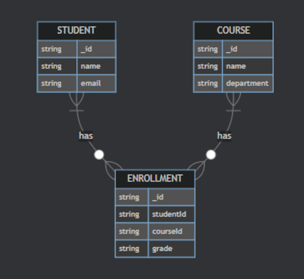

<div dir="rtl">

# מימוש יחסים ב-MongoDB - עם דיאגרמות

## מבוא

MongoDB, כבסיס נתונים לא-רלציוני (NoSQL - Not Only SQL, מערכת שלא מבוססת על המודל הרלציוני המסורתי עם טבלאות קשיחות), מציע גישות שונות למימוש יחסים בין אובייקטים. בניגוד לבסיסי נתונים רלציוניים המסורתיים שמשתמשים בטבלאות ומפתחות זרים (Foreign Keys - עמודות המכילות מזהים שמקשרים בין טבלאות שונות), MongoDB מאפשר גמישות רבה יותר בדרך שבה אנו מייצגים ומממשים קשרים בין ישויות.

מסמך זה מציג את האסטרטגיות השונות למימוש יחסים ב-MongoDB, עם דגש מיוחד על יחסי רבים-לרבים, תוך שימוש בדיאגרמות Mermaid (כלי ליצירת דיאגרמות טקסטואליות) להמחשה.

## סוגי יחסים במסדי נתונים

### יחס אחד-לאחד (One-to-One)

יחס שבו לכל רשומה בקולקציה (Collection - מקבילה לטבלה בבסיסי נתונים רלציוניים, אך גמישה יותר) אחת יש קשר עם רשומה אחת בדיוק בקולקציה אחרת. דוגמה קלאסית: אדם ודרכון - לכל אדם יש דרכון אחד, ולכל דרכון יש בעלים אחד.


</div>

<div dir="ltr">


</div>

<div dir="rtl">

### יחס אחד-לרבים (One-to-Many)

יחס שבו לרשומה אחת בקולקציה יש קשר עם מספר רשומות בקולקציה אחרת, אך כל רשומה מהצד ה"רבים" שייכת לרשומה אחת בלבד. דוגמה: סופר וספרים - לסופר יכולים להיות ספרים רבים, אך כל ספר יש לו סופר אחד.


</div>

<div dir="ltr">


</div>

<div dir="rtl">

### יחס רבים-לרבים (Many-to-Many)

יחס שבו לרשומות בקולקציה אחת יש קשרים מרובים עם רשומות בקולקציה אחרת, ולהיפך. זהו היחס המורכב ביותר. דוגמה: סטודנטים וקורסים - כל סטודנט יכול ללמוד מספר קורסים, וכל קורס יכול להכיל מספר סטודנטים.



</div>

<div dir="ltr">


</div>

<div dir="rtl">

## אסטרטגיות מימוש יחסים ב-MongoDB

### 1. הטמעה (Embedding)

הטמעת מסמכים שלמים זה בתוך זה. זוהי גישה ייחודית לבסיסי נתונים מסמכיים (Document Databases), שבה המידע הקשור נשמר פיזית בתוך אותו מסמך JSON/BSON (Binary JSON - פורמט בינארי יעיל של MongoDB). גישה זו מתאימה כאשר הנתונים נקראים תמיד יחד וגודל המסמך לא גדל ללא גבול.

#### יתרונות הטמעה:
- **ביצועי קריאה מעולים**: קריאה אחת מחזירה את כל המידע
- **עקביות מובטחת**: כל העדכונים מתבצעים בטרנזקציה אטומית אחת (Atomic Transaction - פעולה שמתבצעת במלואה או בכלל לא)
- **פשטות מודל**: אין צורך בשאילתות מורכבות

#### חסרונות הטמעה:
- **הגבלת גודל מסמך**: MongoDB מגביל מסמך ל-16MB
- **כפילות מידע**: אותו מידע עשוי להיות מאוחסן במספר מקומות
- **עדכונים מסובכים**: שינוי במידע מוטמע דורש עדכון במספר מקומות

#### דיאגרמת מסמך עם הטמעה מלאה


#### דוגמת קוד JSON עם הטמעה

</div>

<div dir="ltr">

```json
{
  "_id": "student1",
  "name": "Israel Israeli",
  "email": "israel@example.com",
  "courses": [
    {
      "name": "Mathematics",
      "department": "Exact Sciences",
      "credits": 3,
      "grade": "A"
    },
    {
      "name": "Physics",
      "department": "Exact Sciences",
      "credits": 4,
      "grade": "B+"
    }
  ]
}
```

</div>

<div dir="rtl">

### 2. רפרנסים (References)

שמירת מזהים (IDs - Primary Keys, מפתחות ראשיים ייחודיים המזהים כל רשומה באופן חד-משמעי) של מסמכים קשורים, במקום המסמכים עצמם. זוהי גישה דומה למפתחות זרים בבסיסי נתונים רלציוניים, אך עם גמישות רבה יותר. הגישה מתאימה כאשר המידע הקשור גדול, משתנה לעתים קרובות, או נדרש באופן נפרד.

#### יתרונות רפרנסים:
- **חיסכון במקום**: אין כפילות מידע
- **עדכונים יעילים**: שינוי במסמך אחד משפיע בכל מקום
- **גמישות בשאילתות**: ניתן לשלוף מידע חלקי
- **ללא הגבלת גודל**: כל מסמך יכול לגדול עצמאית

#### חסרונות רפרנסים:
- **ביצועי קריאה איטיים**: נדרשות מספר שאילתות
- **מורכבות ביישום**: דרוש קוד נוסף לחיבור המידע
- **בעיות עקביות**: מידע עלול להיות לא סינכרוני

#### דיאגרמת מסמכים עם רפרנסים

</div>

<div dir="ltr">


</div>

<div dir="rtl">

#### דוגמת קוד JSON עם רפרנסים

</div>

<div dir="ltr">

// Student document
```json

{
  "_id": "student1",
  "name": "Israel Israeli",
  "email": "israel@example.com",
  "courseIds": ["course1", "course2"]
}
```
// Course document
```json


{
  "_id": "course1",
  "name": "Mathematics",
  "department": "Exact Sciences",
  "credits": 3,
  "studentIds": ["student1", "student3", "student4"]
}
```

</div>

<div dir="rtl">

### 3. קולקציית קשר (Relationship Collection)

שימוש בקולקציה נפרדת לניהול הקשרים, בדומה לטבלת קשר ב-SQL (Junction Table - טבלה מתווכת המקשרת בין שתי טבלאות ביחס רבים-לרבים). גישה זו מתאימה במיוחד כאשר לקשר עצמו יש מידע נוסף (כמו ציון, תאריך הרשמה, סטטוס) או כאשר המערכת מורכבת ונדרשת גמישות מקסימלית.

#### יתרונות קולקציית קשר:
- **מידע עשיר על הקשר**: אפשרות לשמור מטא-דאטה (Meta-data - מידע על המידע, כמו תאריכים, סטטוסים ופרמטרים נוספים) על הקשר
- **שאילתות מתקדמות**: אפשרות לחפש לפי מאפייני הקשר
- **ביצועים מאוזנים**: עדכונים מהירים, קריאות בינוניות
- **גמישות מקסימלית**: ניתן להוסיף מידע בעתיד

#### חסרונות קולקציית קשר:
- **מורכבות גבוהה**: דורש ניהול שלוש קולקציות
- **שאילתות מורכבות**: נדרש קוד מתקדם לחיבור הנתונים
- **ביצועי קריאה איטיים**: נדרשות מספר שאילתות לכל אחזור

#### דיאגרמת מודל עם קולקציית קשר


#### דוגמת קוד JSON עם קולקציית קשר
// Student document

</div>

<div dir="ltr">

```json

{
  "_id": "student1",
  "name": "Israel Israeli",
  "email": "israel@example.com"
}
```

// Course document
```json
{
  "_id": "course1",
  "name": "Mathematics",
  "department": "Exact Sciences",
  "credits": 3
}
```

// Enrollment document (relationship collection)
```json
{
  "_id": "enrollment1",
  "studentId": "student1",
  "courseId": "course1",
  "enrollmentDate": "2025-01-15",
  "grade": "A",
  "status": "ACTIVE"
}
```

</div>

<div dir="rtl">

## אסטרטגיות מתקדמות

### 1. הטמעה סלקטיבית (Selective Embedding)

שילוב של הטמעה ורפרנסים - הטמעת מידע בסיסי והפניה למידע מפורט. גישה זו מאפשרת לשלב את היתרונות של שתי השיטות: ביצועי קריאה מהירים למידע הבסיסי, ואפשרות לטעון מידע מפורט בעת הצורך. מתאימה במיוחד כאשר יש מידע שנדרש לעתים קרובות (כמו שם) ומידע שנדרש לעתים רחוקות (כמו פרטים מלאים).


### 2. גישה מבוססת תרחישי שימוש (Usage Pattern Based)

בחירת האסטרטגיה על בסיס ניתוח דפוסי הגישה למידע במערכת. זוהי גישה פרגמטית שמתבססת על מדידות ביצועים בפועל ולא על עקרונות תיאורטיים בלבד.

#### שיקולים לניתוח דפוסי שימוש:
- **תדירות קריאה vs כתיבה**: האם המערכת קוראת הרבה או כותבת הרבה?
- **כיוון הגישה**: האם נגישים בעיקר לסטודנטים או לקורסים?
- **גודל התוצאות**: כמה נתונים בדרך כלל מוחזרים?
- **זמני תגובה נדרשים**: האם נדרשת תגובה מיידית?


## השוואת זמני ביצוע ושיקולי ביצועים

הבנת ההשפעה של כל אסטרטגיה על ביצועי המערכת חיונית לקבלת החלטות נכונות:

### ביצועי קריאה (Read Performance):
- **הטמעה**: מהירה ביותר - שאילתה אחת
- **רפרנסים**: בינונית - מספר שאילתות
- **קולקציית קשר**: איטית יחסית - שאילתות מורכבות

### ביצועי כתיבה (Write Performance):
- **הטמעה**: איטית לעדכונים נפוצים - צריך לעדכן במספר מקומות
- **רפרנסים**: מהירה - עדכון במקום אחד
- **קולקציית קשר**: מהירה מאוד - עדכון של רשומת קשר בלבד

### צריכת זיכרון (Memory Usage):
- **הטמעה**: גבוהה - כפילות מידע
- **רפרנסים**: נמוכה - אין כפילות
- **קולקציית קשר**: בינונית - מידע נוסף על הקשרים


## שיקולי מדרגיות (Scalability Considerations)

### הטמעה ומדרגיות:
- **בעיה**: כאשר המערכת גדלה, המסמכים עלולים להגיע למגבלת ה-16MB
- **פתרון**: מעבר להטמעה סלקטיבית או רפרנסים

### רפרנסים ומדרגיות:
- **יתרון**: כל קולקציה יכולה לגדול עצמאית
- **אתגר**: נדרשים אינדקסים (Indexes - מבני נתונים המאיצים חיפושים) יעילים

### קולקציית קשר ומדרגיות:
- **יתרון**: מדרגיות מעולה - כל חלק גדל עצמאית
- **אתגר**: נדרש שרדינג (Sharding - חלוקת נתונים על שרתים מרובים) מתוחכם

## המלצות ליישום

### תרשים החלטה לבחירת אסטרטגיה


### המלצות ספציפיות לפי תרחיש:

#### מערכת בלוג:
- **מחבר ↔ פוסטים**: רפרנסים (פוסט אחד למחבר אחד, אך מחבר יכול לכתוב פוסטים רבים)
- **פוסט ↔ תגובות**: הטמעה (תגובות נקראות תמיד עם הפוסט)
- **משתמש ↔ לייקים**: קולקציית קשר (נדרש זמן הלייק, מספר הלייקים)

#### מערכת מסחר אלקטרוני:
- **לקוח ↔ הזמנות**: רפרנסים (הזמנות רבות ללקוח)
- **הזמנה ↔ פריטים**: הטמעה (פריטי הזמנה נקראים תמיד יחד)
- **מוצר ↔ קטגוריות**: רפרנסים דו-כיווניים (מוצר יכול להיות במספר קטגוריות)

#### מערכת רשת חברתית:
- **משתמש ↔ פרופיל**: הטמעה (פרופיל נקרא תמיד עם המשתמש)
- **משתמש ↔ חברים**: קולקציית קשר (נדרש תאריך חברות, סטטוס קשר)
- **משתמש ↔ פוסטים**: רפרנסים (פוסטים רבים למשתמש)

## ארכיטקטורה מלאה של יחסי רבים-לרבים

דיאגרמה המציגה את המבנה המלא של מערכת הרישום לקורסים עם כל השיקולים:


## זרימת נתונים בעת רישום סטודנט לקורס

תהליך מפורט הכולל אימותים ואופטימיזציות:


## שיקולי ביצועים מתקדמים

### אינדקסים אסטרטגיים:


### אופטימיזציות שאילתות:
- **Aggregation Pipeline**: לשאילתות מורכבות הכוללות חישובים
- **$lookup**: לחיבור נתונים מקולקציות שונות (כמו JOIN - פעולת חיבור טבלאות בSQL)
- **$facet**: לביצוע מספר שאילתות במקביל (חלוקת השאילתה למספר כיוונים שונים)
- **Read Preferences**: לחלוקת עומס בין replicas (עותקים של בסיס הנתונים על שרתים שונים)

### ניהול זיכרון:
- **Working Set**: וידוא שהנתונים הפעילים נמצאים בזיכרון (חלק מהנתונים שנגיש באופן תכוף ונשמר ב-RAM למהירות גבוהה)
- **Connection Pooling**: ניהול יעיל של חיבורי מסד הנתונים (שיתוף חיבורים קיימים במקום יצירת חיבורים חדשים כל פעם)
- **Caching Strategy**: שכבת cache למידע שנגיש לעתים קרובות


בחירת האסטרטגיה הנכונה למימוש יחסים ב-MongoDB תלויה בגורמים רבים ומורכבים:

### גורמים טכניים:
1. **סוג היחס** (אחד-לאחד, אחד-לרבים, רבים-לרבים)
2. **דפוס הגישה** (כיוון הקריאה הנפוץ ביותר, יחס קריאה/כתיבה)
3. **היקף המידע** (כמות המסמכים, גודל ממוצע, קצב גידול)
4. **דרישות ביצועים** (זמני תגובה, throughput נדרש - כמות הפעולות לשנייה שהמערכת צריכה לטפל בהן)
5. **מדרגיות נדרשת** (האם המערכת צפויה לגדול משמעותית)

### גורמים עסקיים:
1. **קצב השינויים** (תדירות העדכונים, יציבות המודל)
2. **דרישות עקביות** (מיידית, אוונטואלית, או לפי context)
3. **מורכבות פיתוח** (זמן לשוק, מומחיות הצוות)
4. **עלויות תפעול** (משאבי שרת, רישיונות, תחזוקה)

### עקרונות מנחים:
- **התחל פשוט**: בחר בגישה הפשוטה ביותר שעונה על הצרכים
- **מדוד ואופטימז**: השתמש בכלי מוניטורינג לבחינת ביצועים בפועל
- **תכנן לעתיד**: קח בחשבון את הגידול הצפוי במערכת
- **שמור על גמישות**: אפשר מעבר בין אסטרטגיות בעתיד

אין פתרון "אחד מתאים לכולם", וחשוב לבחור את האסטרטגיה המתאימה ביותר לדרישות הספציפיות של המערכת, תוך התחשבות בכל הגורמים הרלוונטיים. במקרים רבים, שילוב של מספר אסטרטגיות באותה מערכת (Hybrid Approach - גישה משולבת המשתמשת בשיטות שונות לחלקים שונים של המערכת) מספק את התוצאה האופטימלית.

## מושגים  הסברים עבורם:

### מושגי בסיס:
- **Foreign Keys** - עמודות המכילות מזהים שמקשרים בין טבלאות שונות
- **Primary Keys** - מפתחות ראשיים ייחודיים המזהים כל רשומה באופן חד-משמעי
- **Junction Table** - טבלה מתווכת המקשרת בין שתי טבלאות ביחס רבים-לרבים

### מושגי טרנזקציות ועקביות:
- **Atomic Transaction** - פעולה שמתבצעת במלואה או בכלל לא
- **Transactions** - מנגנון המבטיח שמספר פעולות יתבצעו יחד או לא יתבצעו כלל
- **Meta-data** - מידע על המידע, כמו תאריכים, סטטוסים ופרמטרים נוספים

### מושגי ביצועים:
- **Throughput** - כמות הפעולות לשנייה שהמערכת צריכה לטפל בהן
- **Working Set** - חלק מהנתונים שנגיש באופן תכוף ונשמר ב-RAM למהירות גבוהה
- **Connection Pooling** - שיתוף חיבורים קיימים במקום יצירת חיבורים חדשים כל פעם

### מושגי אינדקסים ושאילתות:
- **Compound Index** - אינדקס מורכב על שני שדות יחד לחיפוש מהיר
- **Text Indexes** - אינדקסים לחיפוש טקסט מלא בתוכן
- **Geospatial Indexes** - אינדקסים למיקומים גיאוגרפיים
- **Background indexing** - יצירת אינדקסים ברקע מבלי לחסום את המערכת

### מושגי MongoDB מתקדמים:
- **Aggregation Pipeline** - צינור עיבוד לשאילתות מורכבות עם מספר שלבים
- **$lookup** - פעולת חיבור נתונים (כמו JOIN בSQL)
- **$facet** - חלוקת השאילתה למספר כיוונים שונים
- **Replicas** - עותקים של בסיס הנתונים על שרתים שונים

### מושגי ארכיטקטורה:
- **Hybrid Approach** - גישה משולבת המשתמשת בשיטות שונות לחלקים שונים של המערכת

</div>