<div dir="rtl">

# מימוש יחסים ב-MongoDB - עם דיאגרמות

## מבוא

MongoDB, כבסיס נתונים לא-רלציוני (NoSQL), מציע גישות שונות למימוש יחסים בין אובייקטים. בניגוד לבסיסי נתונים רלציוניים המסורתיים, MongoDB מאפשר גמישות רבה יותר בדרך שבה אנו מייצגים ומממשים קשרים בין ישויות.

מסמך זה מציג את האסטרטגיות השונות למימוש יחסים ב-MongoDB, עם דגש מיוחד על יחסי רבים-לרבים, תוך שימוש בדיאגרמות Mermaid להמחשה.

## סוגי יחסים במסדי נתונים

### יחס אחד-לאחד (One-to-One)

יחס שבו לכל רשומה בקולקציה אחת יש קשר עם רשומה אחת בדיוק בקולקציה אחרת.


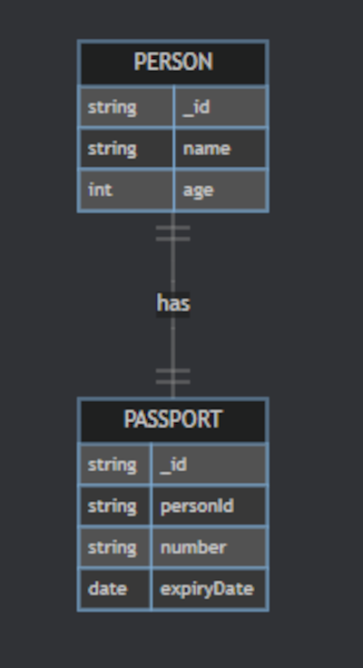

</div>

<div dir="ltr">

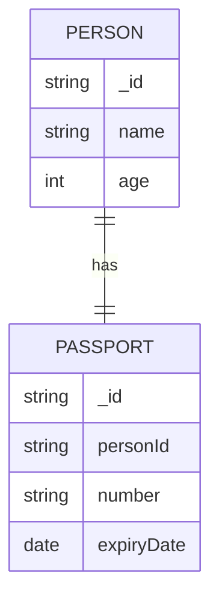
</div>

<div dir="rtl">

### יחס אחד-לרבים (One-to-Many)

יחס שבו לרשומה אחת בקולקציה יש קשר עם מספר רשומות בקולקציה אחרת.

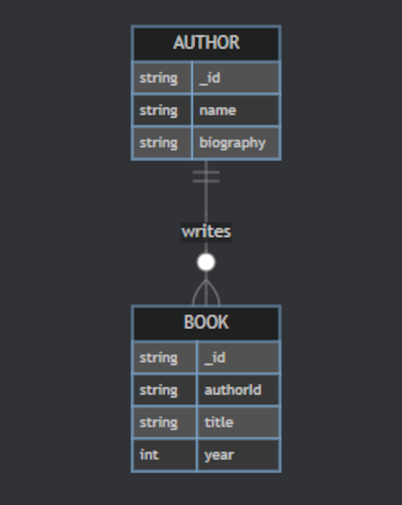

</div>

<div dir="ltr">

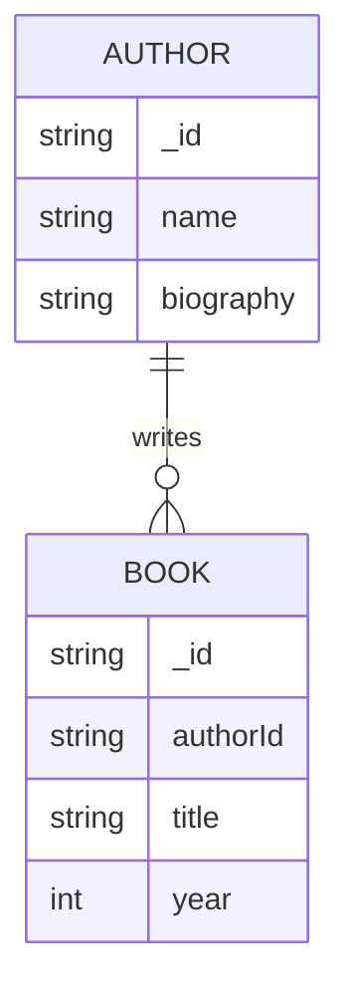

</div>

<div dir="rtl">

### יחס רבים-לרבים (Many-to-Many)

יחס שבו לרשומות בקולקציה אחת יש קשרים מרובים עם רשומות בקולקציה אחרת, ולהיפך.


</div>

<div dir="ltr">

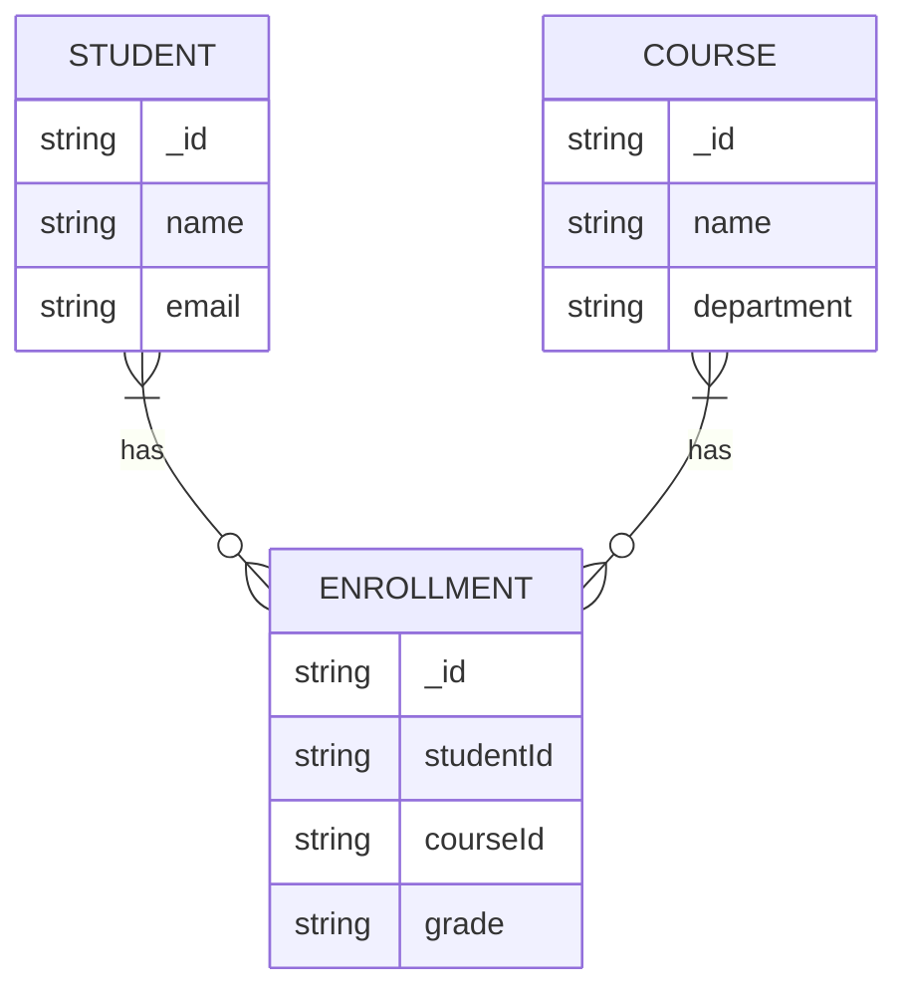

</div>

<div dir="rtl">

## אסטרטגיות מימוש יחסים ב-MongoDB

### 1. הטמעה (Embedding)

הטמעת מסמכים שלמים זה בתוך זה.

#### דיאגרמת מסמך עם הטמעה מלאה

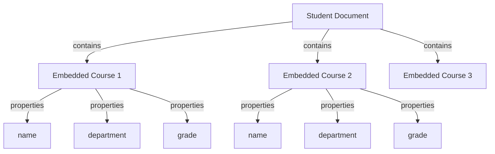

#### דוגמת קוד JSON עם הטמעה

</div>

<div dir="ltr">

```json
{
  "_id": "student1",
  "name": "ישראל ישראלי",
  "email": "israel@example.com",
  "courses": [
    {
      "name": "מתמטיקה",
      "department": "מדעים מדויקים",
      "credits": 3,
      "grade": "A"
    },
    {
      "name": "פיזיקה",
      "department": "מדעים מדויקים",
      "credits": 4,
      "grade": "B+"
    }
  ]
}
```

</div>

<div dir="rtl">

### 2. רפרנסים (References)

שמירת מזהים (IDs) של מסמכים קשורים, במקום המסמכים עצמם.

#### דיאגרמת מסמכים עם רפרנסים

</div>

<div dir="ltr">

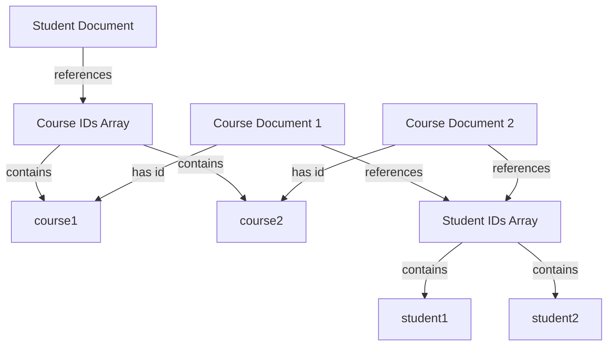
</div>

<div dir="rtl">

#### דוגמת קוד JSON עם רפרנסים

</div>

<div dir="ltr">

// Student document
```json

{
  "_id": "student1",
  "name": "ישראל ישראלי",
  "email": "israel@example.com",
  "courseIds": ["course1", "course2"]
}
```
// Course document
```json


{
  "_id": "course1",
  "name": "מתמטיקה",
  "department": "מדעים מדויקים",
  "credits": 3,
  "studentIds": ["student1", "student3", "student4"]
}
```

</div>

<div dir="rtl">

### 3. קולקציית קשר (Relationship Collection)

שימוש בקולקציה נפרדת לניהול הקשרים, בדומה לטבלת קשר ב-SQL.

#### דיאגרמת מודל עם קולקציית קשר

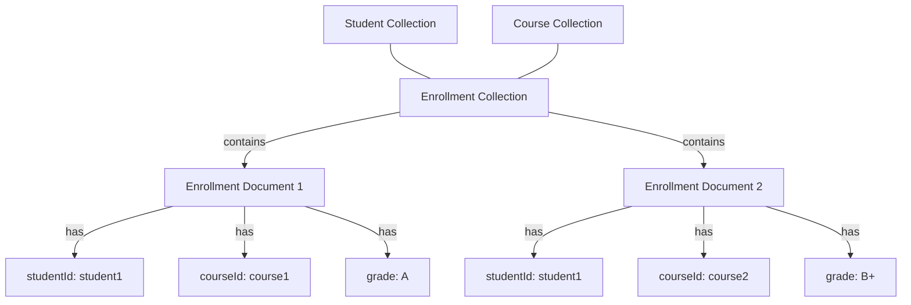

#### דוגמת קוד JSON עם קולקציית קשר
// Student document

</div>

<div dir="ltr">

```json

{
  "_id": "student1",
  "name": "ישראל ישראלי",
  "email": "israel@example.com"
}
```

// Course document
```json
{
  "_id": "course1",
  "name": "מתמטיקה",
  "department": "מדעים מדויקים",
  "credits": 3
}
```

// Enrollment document (relationship collection)
```json
{
  "_id": "enrollment1",
  "studentId": "student1",
  "courseId": "course1",
  "enrollmentDate": "2025-01-15",
  "grade": "A",
  "status": "ACTIVE"
}
```

</div>

<div dir="rtl">

## אסטרטגיות מתקדמות

### 1. הטמעה סלקטיבית (Selective Embedding)

שילוב של הטמעה ורפרנסים - הטמעת מידע בסיסי והפניה למידע מפורט.

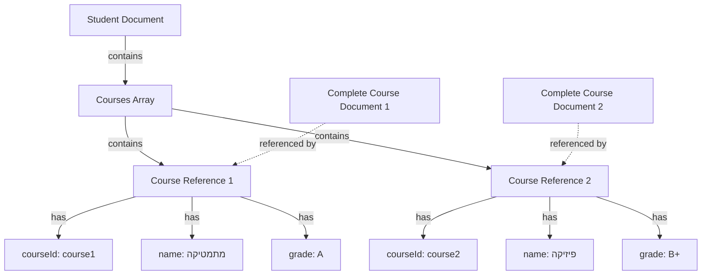

### 2. גישה מבוססת תרחישי שימוש (Usage Pattern Based)

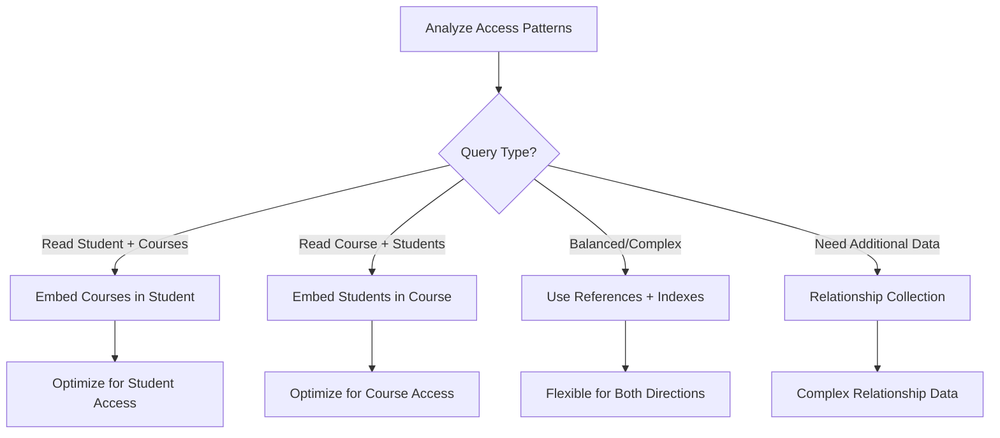

## השוואת זמני ביצוע (פסאודו-דיאגרמה)

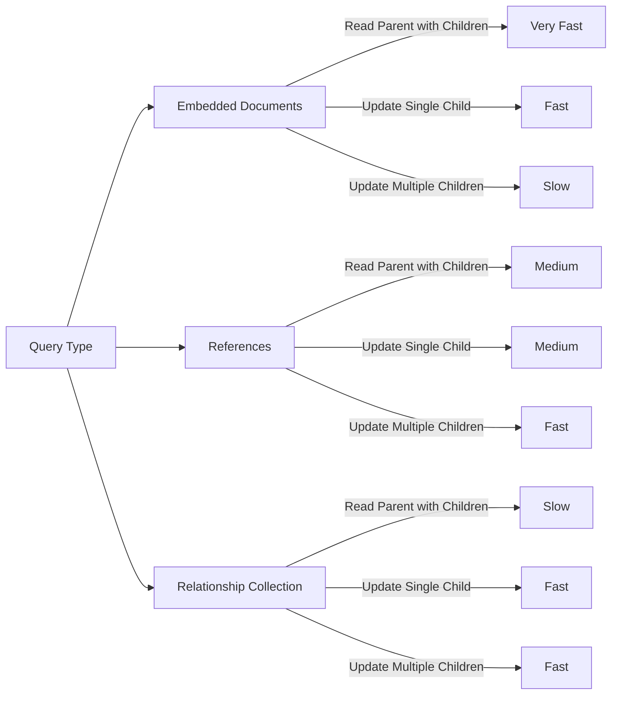

## המלצות ליישום

### תרשים החלטה לבחירת אסטרטגיה

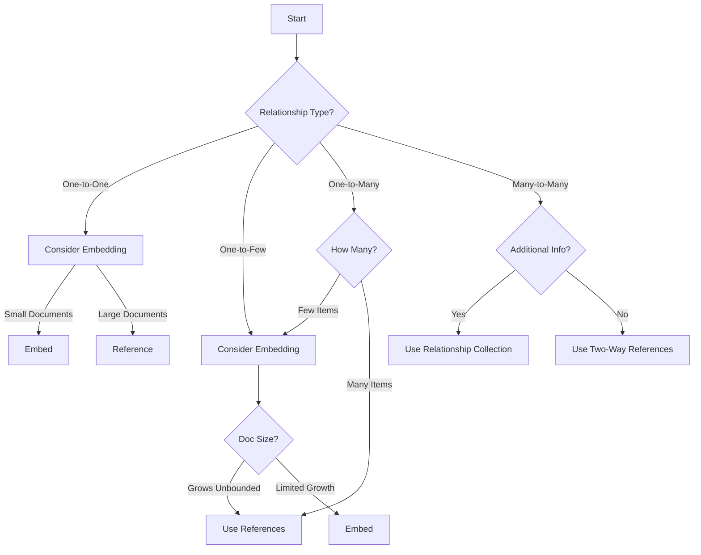

## ארכיטקטורה מלאה של יחסי רבים-לרבים

דיאגרמה המציגה את המבנה המלא של מערכת הרישום לקורסים:

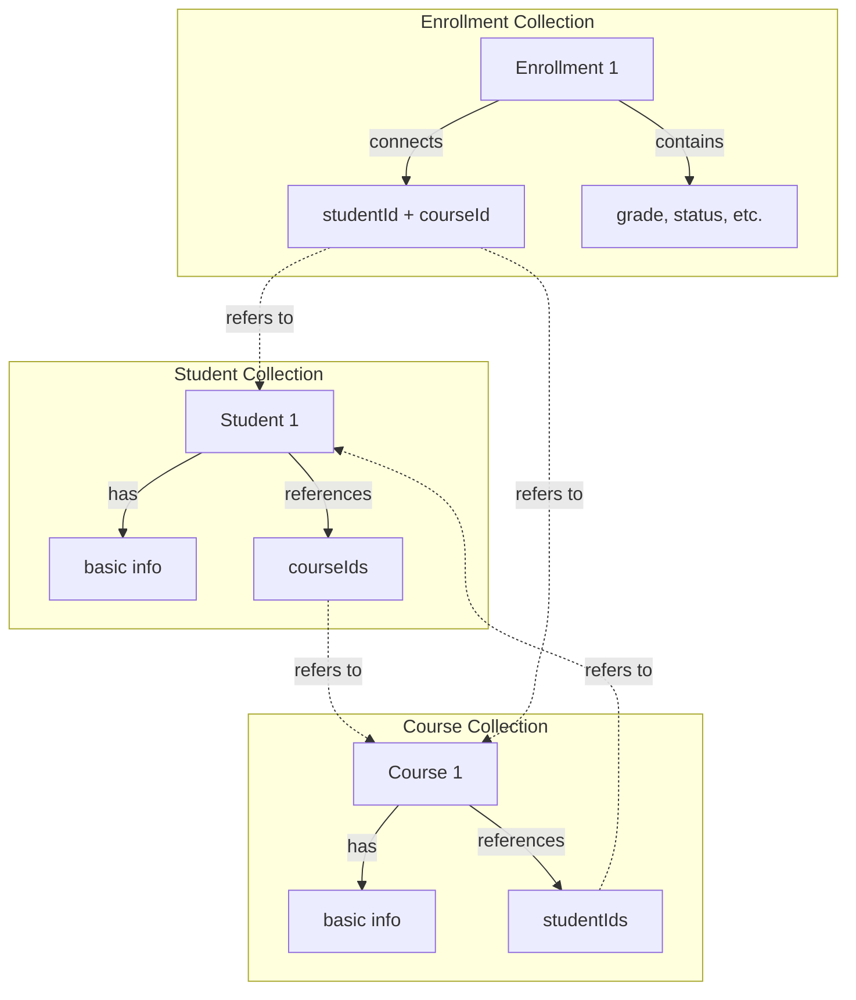

## זרימת נתונים בעת רישום סטודנט לקורס

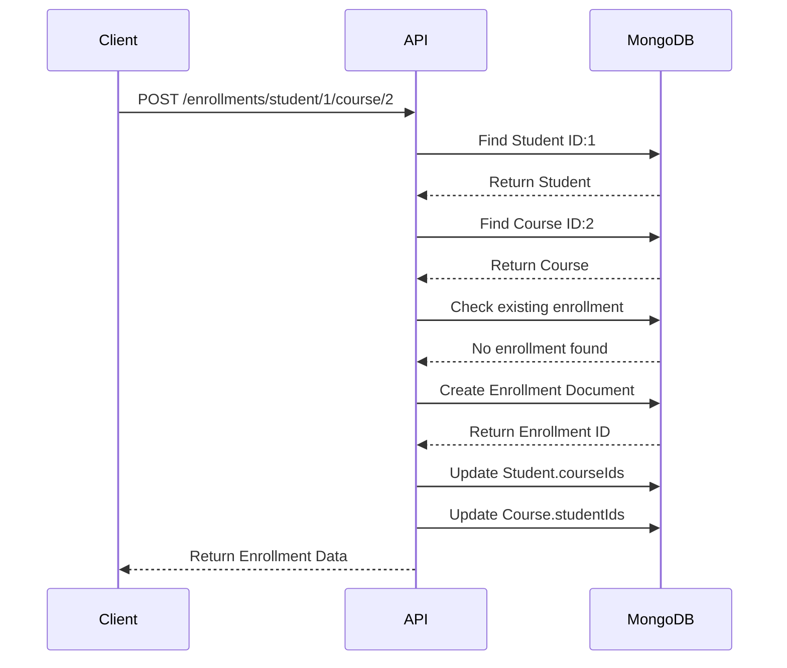

## לסיכום

בחירת האסטרטגיה הנכונה למימוש יחסים ב-MongoDB תלויה בגורמים רבים:

1. **סוג היחס** (אחד-לאחד, אחד-לרבים, רבים-לרבים)
2. **דפוס הגישה** (כיוון הקריאה הנפוץ ביותר)
3. **היקף המידע** (כמות המסמכים בכל קולקציה)
4. **קצב השינויים** (תדירות העדכונים)
5. **דרישות העקביות** (מיידית או אוונטואלית)

אין פתרון "אחד מתאים לכולם", וחשוב לבחור את האסטרטגיה המתאימה ביותר לדרישות הספציפיות של המערכת.
</div>